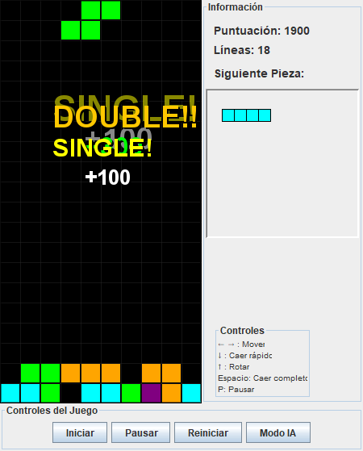
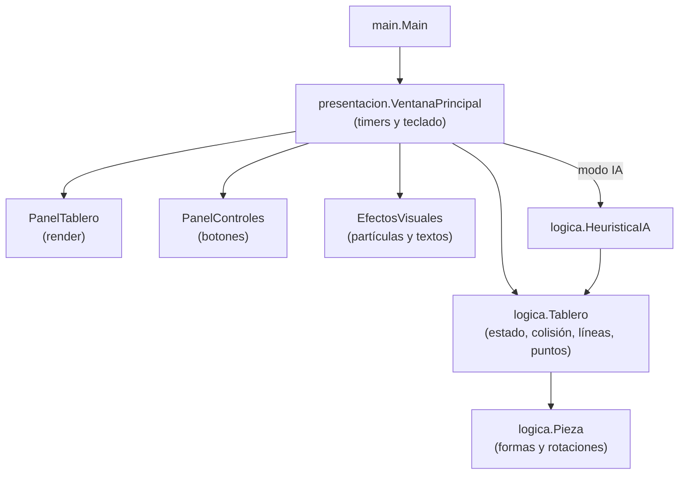

<div align="center">
  
  <h1>TetrisIA</h1>
  <p><b>Tetris de escritorio en Java/Swing con un piloto automático heurístico, sin dependencias externas.</b></p>
  
  
  
  
  <p>
    <a href="#-inicio-rápido">Inicio rápido</a> ·
    <a href="#-características">Características</a> ·
    <a href="#-arquitectura">Arquitectura</a> ·
    <a href="#-pruebas">Pruebas</a> ·
    <a href="#-lo-que-todavía-no-existe">Limitaciones</a>
  </p>
</div>

TetrisIA es un Tetris clásico (tablero de 10×20, 7 tetrominós) con un modo manual por teclado y un modo
"IA" que coloca las piezas solo. La IA es un **evaluador heurístico de una sola pieza**, no una red
entrenada ni una búsqueda profunda: sirve como referencia legible de la lógica de Tetris y como base para
experimentar con tu propia heurística. No es un clon fiel de ningún Tetris comercial.

## 🎬 Vista rápida

Captura real del juego con el modo IA activo (la ventana muestra los efectos de líneas completadas):

<div align="center">
  
</div>

## ✨ Características

| Característica | Detalle |
|:---|:---|
| Piezas y rotaciones | 7 tetrominós (I, J, L, O, S, T, Z) con sus 4 rotaciones (`Pieza.java`) |
| Colisión por celda | Se comprueba celda a celda, no por caja delimitadora (`Tablero.esMovimientoValido`) |
| Wall kick simple | Si la rotación no cabe, prueba una lista fija de desplazamientos; no es la tabla SRS completa |
| Líneas | Elimina líneas completas, incluidas varias no contiguas, sin duplicar ni perder filas |
| Puntuación | 100 / 300 / 500 / 800 puntos por 1 / 2 / 3 / 4 líneas (escala propia, sin niveles) |
| Modo IA | Prueba todas las columnas × rotaciones de la pieza actual y elige la de mejor puntuación |
| Efectos | Parpadeo de líneas, textos flotantes (SINGLE/DOUBLE/TRIPLE/TETRIS), partículas y overlay de game over |
| Sin dependencias | Solo el JDK: Swing, `Graphics2D` y `javax.swing.Timer` |

### Cómo decide la IA

`HeuristicaIA` simula la caída de la pieza actual en cada combinación de columna y rotación y puntúa el
tablero resultante con pesos fijos:

```text
puntuación = líneas_completadas × 2.0
           − altura_total × 0.5
           − huecos × 0.75
           − irregularidad_superficie × 0.3
           − altura_máxima × 0.8
```

No usa la pieza siguiente, no hace búsqueda de varias piezas y los pesos no se aprenden ni se ajustan.

### Controles (modo manual)

| Tecla | Acción |
|:---:|:---|
| ← / → | Mover la pieza |
| ↓ | Caída suave |
| ↑ | Rotar (con wall kick) |
| Espacio | Caída instantánea |
| P | Pausar / reanudar |

Botones de la ventana: **Iniciar**, **Pausar**, **Reiniciar** y **Modo IA** (con la IA activa el teclado
no controla la pieza).

## 🏗️ Arquitectura

La lógica (`logica/`) no depende de Swing; la interfaz (`presentacion/`) solo la dibuja y la maneja.



<details>
<summary>Estructura de carpetas</summary>

```text
TetrisIA/
├── src/
│   ├── main/Main.java
│   ├── logica/            Tablero, Pieza, HeuristicaIA
│   ├── presentacion/      VentanaPrincipal, PanelTablero, PanelControles, EfectosVisuales
│   └── test/logica/       6 clases de prueba JUnit 5
├── .github/workflows/ci.yml
├── ejecutar.bat           Lanzador para Windows (compila y ejecuta)
└── LICENSE
```

</details>

## 🚀 Inicio rápido

| Requisito | Versión |
|:---|:---|
| JDK con `javac` | El CI usa 17 y 21 (temurin); no se ha verificado con versiones anteriores |

1. Clona el repositorio:
   ```bash
   git clone https://github.com/Luiss2080/TetrisIA.git
   cd TetrisIA
   ```
2. Compila y ejecuta (no usa Maven ni Gradle):
   ```bash
   # Linux / macOS
   mkdir -p bin && javac -d bin $(find src/main src/logica src/presentacion -name "*.java")
   java -cp bin main.Main
   ```
   ```bat
   :: Windows: compila y ejecuta con un solo comando
   ejecutar.bat
   ```
3. Pulsa **Iniciar** y, si quieres, **Modo IA**.

## 🧪 Pruebas

Hay **42 pruebas** JUnit 5 en `src/test/logica` (verificadas localmente y ejecutadas en el CI con JDK 17 y 21).
Cubren colisión, rotación y wall kick, limpieza de líneas (incluido el caso no contiguo), puntuación, game
over, geometría de las piezas y la elección de movimientos de la IA. La interfaz Swing no tiene pruebas.

<details>
<summary>Cómo ejecutarlas</summary>

Se usa el ejecutable [JUnit Platform Console Standalone](https://junit.org/junit5/docs/current/user-guide/#running-tests-console-launcher):

```bash
curl -sL -o junit-platform-console-standalone.jar \
  https://repo1.maven.org/maven2/org/junit/platform/junit-platform-console-standalone/1.10.2/junit-platform-console-standalone-1.10.2.jar
mkdir -p build/main build/test
javac -d build/main $(find src/main src/logica src/presentacion -name "*.java")
javac -cp "build/main:junit-platform-console-standalone.jar" -d build/test $(find src/test -name "*.java")
java -jar junit-platform-console-standalone.jar execute -cp "build/main:build/test" --scan-classpath --details=tree
```

En Windows usa `;` en lugar de `:` como separador de classpath.

</details>

## 🚧 Lo que todavía no existe

- Niveles o velocidad creciente: la caída va a un ritmo fijo.
- Sonido y persistencia de récords o estadísticas.
- La IA no mira la pieza siguiente ni planifica varias piezas.
- El wall kick es una lista fija, no la tabla SRS por pieza y transición.
- Pruebas de la interfaz gráfica.

## 📄 Licencia

MIT. Consulta [`LICENSE`](LICENSE).

<div align="center"><sub>Hecho por Luiss2080 · Java, Swing y una heurística de una pieza</sub></div>
